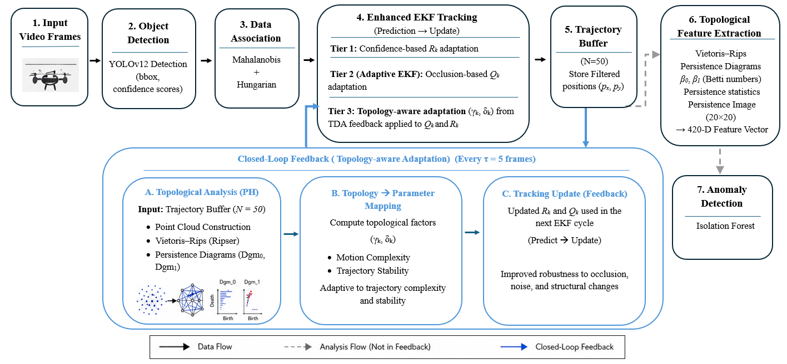

# TopoEKF: UAV-Based Multi-Object Tracking and Anomaly Detection

TopoEKF is a UAV-oriented multi-object tracking and anomaly detection framework that combines deep learning-based object detection, adaptive state estimation, and topological data analysis.

The system uses a YOLO-based detector for object localization, an Adaptive Extended Kalman Filter for robust trajectory estimation, and persistent homology-based topological features for anomaly detection and topology-aware filtering.

The repository accompanies the study **"TopoEKF: From State-Space Estimation to Topological Signatures for Enhanced Multi-Object Tracking and Anomaly Detection in UAVs."**

## Authors

- [Rabia Kiratli](https://github.com/your-rabia-profile)
- [Alperen Eroglu](https://github.com/your-alperen-profile)
- [Hatice Unlu Eroglu](https://github.com/your-hatice-profile)

Affiliation: Necmettin Erbakan University

---

## Demo

The repository includes one annotated output video and a lightweight GIF preview.


- Output video: [`assets/results/topoekf_demo.mp4`](assets/results/topoekf_demo.mp4)
- Visualization convention:
  - Green: normal tracked vehicle
  - Yellow: anomalous vehicle
  - Red: crash or collision candidate
  - Gray: raw detector bounding box

---

## Project Overview

UAV-based aerial surveillance systems face several real-world challenges:

- Small object detection from high-altitude aerial views
- Camera vibration and platform instability
- Frequent occlusion between moving objects
- Low-resolution targets
- Motion blur and environmental noise
- Identity switches in multi-object tracking
- Abnormal trajectory detection in dynamic scenes

This project addresses these problems by combining:

1. **YOLO-based object detection**
2. **Adaptive Extended Kalman Filter tracking**
3. **Mahalanobis-distance-based data association**
4. **Topological Data Analysis using Persistent Homology**
5. **Isolation Forest-based anomaly detection**

---

## System Architecture

The overall pipeline consists of the following stages:

```text
Input UAV Video Frames
        |
        v
YOLO Object Detection
        |
        v
Bounding Box + Confidence Extraction
        |
        v
Data Association
Mahalanobis Distance + Hungarian Algorithm
        |
        v
Adaptive Extended Kalman Filter
        |
        v
Trajectory Buffer
        |
        v
Persistent Homology / TDA Feature Extraction
        |
        v
Topology-Aware Covariance Update
        |
        v
Anomaly Detection
Isolation Forest
        |
        v
Tracked Objects + Anomaly Labels + Output Video
```



## Main Contributions

- A modular UAV tracking pipeline built around detector, tracker, topology, anomaly, and visualization layers.
- Three-tier adaptive EKF covariance control:
  - confidence-aware measurement noise adaptation,
  - occlusion-aware process noise adaptation,
  - topology-aware covariance feedback.
- Mahalanobis-distance association with Hungarian assignment.
- Persistent homology-based trajectory representation using Betti numbers, persistence statistics, and persistence images.
- Status-aware visualization for normal, anomalous, and crash/collision candidate vehicles.

## Repository Structure

```text
topoekf/
|-- assets/
|   `-- results/                 # Demo video and README GIF preview
|-- configs/                     # Detector, EKF, TDA, anomaly settings
|-- data/                        # Dataset layout notes
|-- docs/                        # Methodology and GitHub release notes
|-- scripts/                     # CLI entry points
|-- src/topoekf/                 # Python package
|   |-- anomaly/
|   |-- detection/
|   |-- pipeline/
|   |-- topology/
|   |-- tracking/
|   `-- visualization/
`-- tests/                       # Unit and integration tests
```

## Installation

Python 3.10 or newer is recommended.

```bash
python -m venv .venv
```

Windows:

```powershell
.venv\Scripts\activate
pip install -r requirements.txt
pip install -e .
```

Linux/macOS:

```bash
source .venv/bin/activate
pip install -r requirements.txt
pip install -e .
```

## Quick Start

Download or place a YOLO model weight file in the repository root. The default model is `yolo12n.pt`.

```powershell
python scripts/run_tracking.py "path\to\uav_video.mp4" --output "data\results\tracked.mp4"
```

For small UAV targets, the default detector settings use:

```text
confidence = 0.10
image size = 960
vehicle classes = 2,3,5,7
```

You can override them from the CLI:

```powershell
python scripts/run_tracking.py "path\to\uav_video.mp4" --model yolo12n.pt --confidence 0.08 --imgsz 1280 --output "data\results\tracked.mp4" --debug
```

## Method Summary

The tracker estimates a constant-velocity state vector:

```text
x_k = [p_x, p_y, v_x, v_y]^T
```

Detection centroids are associated with predicted tracks through Mahalanobis distance and Hungarian assignment. The EKF uses adaptive covariance updates driven by detection confidence, missed detections, scene uncertainty, and topological feedback from recent trajectories.

Trajectory buffers are converted into topological features through persistent homology. The anomaly module then classifies trajectory behavior using an Isolation Forest model. See [`docs/METHODOLOGY.md`](docs/METHODOLOGY.md) for implementation-level details.

## Testing

```bash
python -m pytest tests -q -p no:cacheprovider
```

Expected status in the prepared release:

```text
31 passed
```

## Citation

If you use this project, please cite the accompanying article metadata. A draft citation file is provided in [`CITATION.cff`](CITATION.cff). Update the final title, venue, DOI, and publication year before making the repository public.


